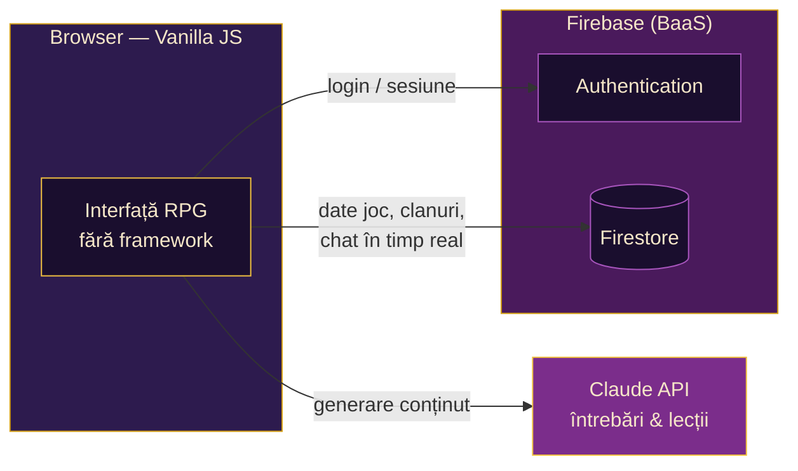

<div align="center">


**Un joc RPG educațional în care înveți luptând — întrebările sunt generate de AI, la orice materie, pentru orice clasă.**

<br/>


<br/>

*Duolingo întâlnește universul RPG: elevii se luptă cu monștri răspunzând la întrebări
generate live de un model AI, câștigă aur și EXP, deschid cufere, se echipează
și concurează în clanuri.*

</div>

---

## Cuprins

- [Funcționalități](#funcționalități)
- [Arhitectură](#arhitectură)
- [Structura proiectului](#structura-proiectului)
- [Instalare & configurare](#instalare--configurare)
- [Panoul de administrare](#panoul-de-administrare)
- [Securitate — ce trebuie să știi](#securitate--ce-trebuie-să-știi)
- [Costuri AI](#costuri-ai)

---

## Funcționalități

| Sistem | Descriere |
|---|---|
| **Lupte cu AI** | Întrebări grilă generate live de Claude, adaptate la materie, subiect și clasa jucătorului. Lecții narative generate înaintea etapelor de tip „lecție". |
| **7 tărâmuri** | Biologie, Matematică, Istorie, Chimie, Fizică, Literatură, Informatică — fiecare cu propriul drum de nivele și boss final. |
| **Loot & echipament** | Cufere (comune / rare / epice) cu echipament pasiv (+XP, +aur), consumabile și aur. Echipezi maxim 3 piese. |
| **Magazin pe categorii** | Poțiuni, arme, apărare, cunoaștere, noroc + cufere la preț piperat. Cumperi mai multe consumabile odată. |
| **Clanuri** | Creezi sau te alături cu un cod de invitație, listă publică de clanuri, tag afișat lângă nume. |
| **Chat de clan** | În timp real (stil Discord): poze de profil, grupare de mesaje, imagini și GIF-uri, moderare de către lider. |
| **Misiuni zilnice** | 3 misiuni personale + 2 de clan, aceleași pentru toți jucătorii, rotite zilnic **fără server** (selecție determinată de dată). |
| **Buffuri de clan** | Monedele de clan câștigate din misiuni cumpără +10% XP / aur pentru **toți** membrii, pe durată limitată. |
| **5 limbi** | Interfața completă în română, engleză, franceză, germană, spaniolă — schimbarea limbii re-randează instant pagina curentă. |
| **Iconițe custom** | Orice emoji din joc poate fi înlocuit cu artă proprie (PNG în `assets/icons/`) — cu fallback automat la emoji. |

---

## Arhitectură

Proiectul rulează **fără backend propriu** — frontend static + servicii gestionate (BaaS):
niciun server de întreținut, costuri zero în repaus.



Decizii de proiectare demne de menționat:

- **Misiuni zilnice deterministe** — data zilei alimentează un generator pseudo-aleator
  (FNV-1a + mulberry32), deci toți jucătorii calculează local aceeași selecție. Zero
  infrastructură de server pentru un sistem „live".
- **Media fără Firebase Storage** — avatarurile și imaginile din chat sunt redimensionate
  în browser (canvas) și stocate ca data-URL în Firestore, cu plafoane de mărime la
  ambele capete.
- **Securitate prin reguli Firestore** — accesul per-utilizator, panoul de admin protejat
  printr-o listă de UID-uri, scrieri în clan doar pentru membri.

---

## Structura proiectului

```text
├── index.html            punctul de intrare al jocului
├── admin.html            panoul de administrare (separat, minimal)
├── css/                  10 foi de stil (temă RPG: violet + auriu, font pixel)
├── assets/               imagini, iconițe custom (opțional), sunete (opțional)
└── js/
    ├── main.js           orchestratorul aplicației
    ├── admin.js          logica panoului de admin (self-contained)
    ├── game.js           datele materiilor și nivelelor
    ├── levels/           conținutul celor 7 tărâmuri
    ├── core/             firebase-config · auth · db
    ├── systems/          battle · powerups · equipment · loot · clans
    │                     missions · gameconfig · aistats · chatfilter
    └── ui/               ui · i18n · i18n-app · icons · onboarding · settings · sfx
```

---

## Instalare & configurare

**1. Firebase** — creează un proiect pe [console.firebase.google.com](https://console.firebase.google.com),
activează *Authentication* (Email + Google) și *Firestore*, apoi copiază configurația în
`js/core/firebase-config.js`.

**2. Reguli Firestore** — publică `firestore.rules` din repo:

```bash
firebase deploy --only firestore:rules
```

**3. Cont de admin** — în Firestore creează documentul `config/admins` cu un câmp
`uids` de tip **array** conținând UID-ul tău.

**4. Cheia Claude** — creează o cheie pe [platform.claude.com](https://platform.claude.com)
(necesită credite preplătite, minim 5 $) și pune-o în `js/systems/battle.js`:

```js
const CLAUDE_API_KEY = 'cheia-ta-aici';
```

**5. Găzduire** — orice hosting static merge; cu Firebase Hosting:

```bash
firebase deploy
```

> [!NOTE]
> Fișierele din `assets/icons/` și `assets/sfx/` sunt **opționale** — jocul folosește
> emoji și rulează silențios până le adaugi, apoi le preia automat.

---

<div align="center">
<sub>Proiect realizat de YOYØ și Mitzaa.</sub>
</div>
